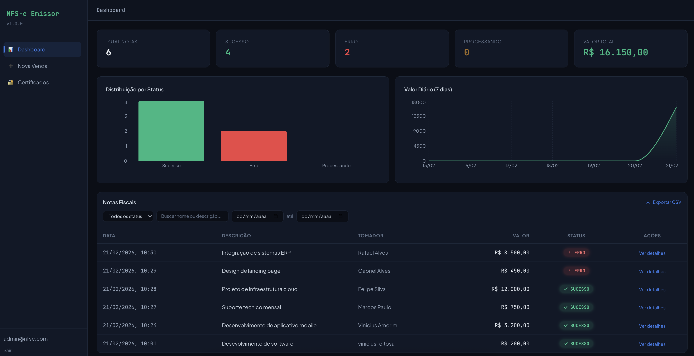

# NFS-e Emissor - Sistema Simplificado de Emissao de Notas Fiscais

Sistema full stack containerizado para simular emissao de NFS-e (Nota Fiscal de Servico Eletronica) com processamento assincrono via fila.



## Como Rodar

```bash
git clone <repo>
cd nfse-emissor
cp .env.example .env
docker compose up --build
```

### URLs

| Servico          | URL                        |
|------------------|----------------------------|
| Frontend         | http://localhost:5173       |
| API              | http://localhost:3001       |
| Prefeitura Mock  | http://localhost:3002       |

### Credenciais de Demo

- **Email:** `admin@nfse.com`
- **Senha:** `admin123`

## Arquitetura

```
Frontend (React) --> API (Express) --> Redis (BullMQ Queue)
                                            |
                                      Worker (BullMQ)
                                            |
                                      Prefeitura Mock
```

### Servicos

| Servico          | Tecnologia                | Descricao                                |
|------------------|---------------------------|------------------------------------------|
| API              | Node.js + Express + TS    | REST API com autenticacao JWT            |
| Worker           | Node.js + BullMQ + TS     | Consumidor de fila, processa emissoes    |
| Prefeitura Mock  | Node.js + Express         | Simula resposta da prefeitura (70/30)    |
| Frontend         | React + Vite + Tailwind   | SPA com tema dark "terminal financeiro"  |
| DB               | PostgreSQL 16             | Banco de dados com Prisma ORM            |
| Redis            | Redis 7                   | Fila de mensagens para BullMQ            |

## Endpoints da API

| Metodo | Rota                    | Descricao                       | Auth |
|--------|-------------------------|---------------------------------|------|
| POST   | /auth/login             | Login, retorna JWT              | Nao  |
| POST   | /certificates/upload    | Upload de certificado .pfx      | Sim  |
| GET    | /certificates           | Lista certificados do usuario   | Sim  |
| DELETE | /certificates/:id       | Desativa certificado            | Sim  |
| POST   | /sales                  | Cria venda (retorna 202)        | Sim  |
| GET    | /sales                  | Lista vendas com paginacao      | Sim  |
| GET    | /sales/:id              | Detalhes de uma venda           | Sim  |
| GET    | /health                 | Health check                    | Nao  |

## Decisoes de Arquitetura

### Assinatura XML Simplificada

A assinatura digital do XML e simulada: gera-se um hash SHA-256 do conteudo XML concatenado com o fingerprint do certificado, inserido como tag `<Signature>` no XML. Em producao, seria utilizada uma biblioteca como `xml-crypto` com o certificado real.

### Criptografia de Certificados (AES-256-GCM)

Os arquivos .pfx e senhas de certificados sao criptografados com AES-256-GCM antes de salvar no banco:
- **IV**: 16 bytes aleatorios gerados a cada operacao
- **AuthTag**: 16 bytes para autenticacao
- **Layout**: `[IV (16 bytes)][AuthTag (16 bytes)][Ciphertext]`
- **Chave**: 32 caracteres via variavel `CERTIFICATE_ENCRYPTION_KEY`
- Senhas NUNCA sao salvas em texto puro, base64, ou hash simples

### Retries e Backoff Exponencial

O Worker BullMQ utiliza backoff customizado para retentativas:
- Tentativa 1: espera 1 segundo
- Tentativa 2: espera 4 segundos
- Tentativa 3: espera 16 segundos
- Formula: `1000 * 4^(tentativa - 1)`

Apenas erros de rede/timeout geram retry. Rejeicoes da prefeitura sao definitivas.

### Idempotencia

O campo `idempotencyKey` (UUID) previne emissoes duplicadas:
1. Antes de criar, verifica se ja existe sale com essa chave
2. Se existir, retorna a sale existente (HTTP 200)
3. Constraint unique no banco garante atomicidade

### Processamento Assincrono

O `POST /sales` NUNCA processa a emissao diretamente:
1. Salva sale com status PROCESSING
2. Enfileira job no Redis via BullMQ
3. Retorna 202 Accepted imediatamente
4. Worker consome o job e faz POST HTTP para a prefeitura mock

### Webhook

Quando uma NFS-e e emitida com sucesso e `WEBHOOK_URL` esta configurada, o Worker faz POST com:
```json
{
  "event": "nfse.issued",
  "saleId": "uuid",
  "protocol": "PROT-XXXX",
  "amount": 1500.00,
  "issuedAt": "2025-01-01T00:00:00Z"
}
```

## Certificado de Teste

Qualquer arquivo `.pfx` pode ser usado para teste. Para gerar um com OpenSSL:

```bash
openssl req -x509 -newkey rsa:2048 -keyout key.pem -out cert.pem -days 365 -nodes -subj "/CN=Teste"
openssl pkcs12 -export -out teste.pfx -inkey key.pem -in cert.pem -passout pass:123456
```

Depois, faca upload do `teste.pfx` com senha `123456` na pagina de Certificados.

## Stack Utilizada

| Camada      | Tecnologia             | Versao   |
|-------------|------------------------|----------|
| Runtime     | Node.js                | 20 LTS   |
| Linguagem   | TypeScript             | ^5.6     |
| API         | Express                | ^4.21    |
| ORM         | Prisma                 | ^5.20    |
| Fila        | BullMQ                 | ^5.12    |
| Banco       | PostgreSQL             | 16       |
| Cache/Fila  | Redis                  | 7        |
| Frontend    | React                  | ^18.3    |
| Bundler     | Vite                   | ^5.4     |
| CSS         | Tailwind CSS           | ^3.4     |
| Graficos    | Recharts               | ^3.7     |
| HTTP Client | Axios                  | ^1.7     |
| Auth        | JSON Web Token         | ^9.0     |
| Crypto      | bcryptjs               | ^2.4     |
| Upload      | Multer                 | ^1.4     |
| Validacao   | Zod                    | ^3.23    |
| Container   | Docker + Compose       | v2       |
| Proxy       | Nginx (Alpine)         | latest   |

## Diferenciais

### UI/UX

- **Graficos interativos (Recharts)**: dashboard com grafico de barras por status e grafico de area com valores diarios dos ultimos 7 dias, tooltips estilizados no tema dark
- **Filtros avancados**: busca textual (nome/descricao), filtro por status (dropdown), filtro por intervalo de datas, botao "Limpar filtros" — todos com query params no backend (Prisma `contains` case-insensitive)
- **Export CSV**: exporta as vendas filtradas para CSV com um clique, nome do arquivo com data atual
- **Animacoes staggered (CSS puro)**: cards do dashboard entram com delay escalonado (60ms entre cada), linhas da tabela com stagger de 40ms, tudo via `animation-delay` sem JavaScript
- **Skeleton loading**: shimmer effect com gradient animado para cards, tabela e lista de certificados durante carregamento inicial
- **Contagem animada**: numeros do dashboard fazem counting animation com easeOutCubic via `requestAnimationFrame`
- **Toasts melhorados**: slide-in animation, icones coloridos por tipo (verde/vermelho), duracao de 4s, estilo consistente com o tema dark
- **Drag & drop certificados**: feedback visual com scale (1.01), icones SVG para estados (upload/sucesso), transicao suave de 300ms
- **Validacao de senha .pfx**: antes de salvar, a API valida se a senha realmente abre o certificado via `tls.createSecureContext`, com `NODE_OPTIONS=--openssl-legacy-provider` para compatibilidade com OpenSSL 3.x
- **StatusBadge com icones animados**: PROCESSING com spinner SVG + pulse-glow, SUCCESS com checkmark bounce-in, ERROR com icone shake
- **Sidebar responsiva**: drawer mobile com hamburger, barra azul indicadora de rota ativa, overlay animado
- **Modal animado**: entrada com scale + translateY via `cubic-bezier(0.16, 1, 0.3, 1)`, overlay com fade
- **Empty states**: ilustracoes SVG flutuantes (animacao float 3s) com mensagens contextuais para dashboard vazio e certificados vazios
- **Scrollbar customizada**: estilo minimalista com 6px de largura, consistente com o tema

### Backend

- **Criptografia AES-256-GCM** para certificados .pfx e senhas (IV + AuthTag + Ciphertext)
- **Idempotencia** via `idempotencyKey` com constraint unique + double-check pattern
- **Backoff exponencial customizado** no BullMQ: 1s → 4s → 16s (`1000 * 4^(n-1)`)
- **Webhook** automatico em caso de sucesso (configuravel via env)
- **Processamento 100% assincrono**: POST /sales retorna 202 imediatamente

## Trade-offs e Limitacoes

### O que nao foi feito e por que

| Item | Motivo |
|------|--------|
| **Testes unitarios/integracao** | O escopo do desafio prioriza a implementacao funcional. Em producao, usaria Jest + Supertest para API, Testing Library para frontend, e testes de integracao com Testcontainers (Postgres + Redis reais). |
| **CI/CD pipeline** | Nao havia requisito de deploy. Em producao, configuraria GitHub Actions com etapas: lint, test, build, push de imagens Docker para registry, e deploy via docker-compose ou Kubernetes. |
| **SOAP real da prefeitura** | O spec pede um mock. A integracao real com Web Services ABRASF exigiria: parsing/geracao de SOAP XML com namespaces corretos, certificado A1 real, e tratamento dos codigos de retorno especificos de cada prefeitura. |
| **Assinatura digital real (XMLDsig)** | Implementar assinatura digital W3C XMLDsig com canonicalizacao C14N, SHA-256 + RSA-SHA256, e insercao de `<ds:Signature>` exigiria `xml-crypto` ou `xmldsigjs`. O mock usa SHA-256 do conteudo + fingerprint do certificado. |
| **Rate limiting** | Nao implementado na API. Em producao, usaria `express-rate-limit` com Redis store para limitar requests por IP/usuario. |
| **Logs estruturados** | Usa `console.log` simples. Em producao, usaria Winston ou Pino com formato JSON, niveis de log, e integracao com servico de observabilidade (Datadog, Grafana). |
| **Renovacao de JWT** | O token expira em 24h sem refresh token. Em producao, implementaria refresh token rotation com blacklist no Redis. |
| **Multi-tenancy** | O sistema suporta apenas um usuario de demonstracao. Em producao, o seed criaria roles/permissions e o registro seria aberto ou via convite. |
| **Migracao de banco robusta** | Usa uma unica migracao inicial. Em producao, cada alteracao de schema seria uma migracao incremental versionada. |

### Decisoes conscientes

- **CSS animations em vez de Framer Motion**: menos 50KB no bundle, zero dependencia extra, performance nativa do browser via GPU compositing
- **Recharts em vez de D3 puro**: API declarativa React-friendly, ~180KB mas com tree-shaking eficiente para os 2 graficos usados
- **Polling 5s em vez de WebSocket**: simplicidade de implementacao para o scope do projeto; WebSocket seria necessario apenas com centenas de usuarios simultaneos
- **AES-256-GCM em vez de AES-256-CBC**: GCM fornece autenticacao integrada (AuthTag), prevenindo ataques de padding oracle sem necessidade de HMAC separado
- **BullMQ em vez de RabbitMQ**: integracao nativa com Redis (ja necessario para fila), API TypeScript-first, menor overhead operacional

## Variaveis de Ambiente

Veja `.env.example` para todas as variaveis necessarias.
